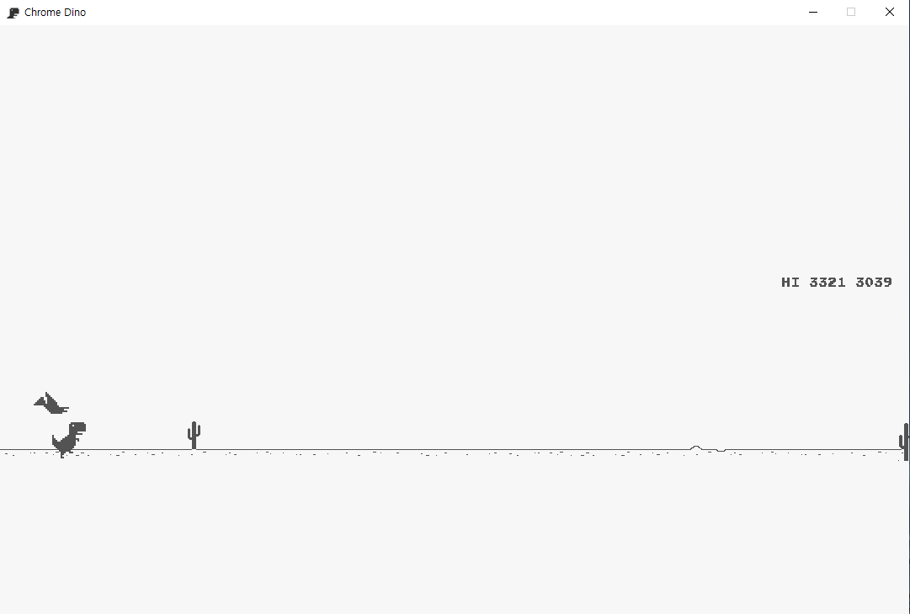

# Chrome Dino
Chrome Dino  in Python!!   
This project was developed in Python(v.3.11.7) and was edited in my style.

## Contorols
- Jump using **up arrow**.
- Crouch to fall fast using **down arrow**.
- Press **mouse click** to restart the game.
- You can end the game immediately using **del**.
- Reset high score using **number 0**.

## Require
- pygame
* * *
made by [SquareBracket](https://github.com/SquareBracket-GitHub)